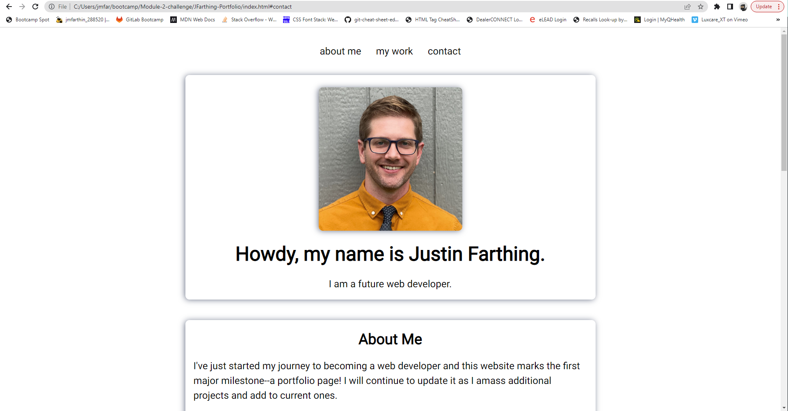
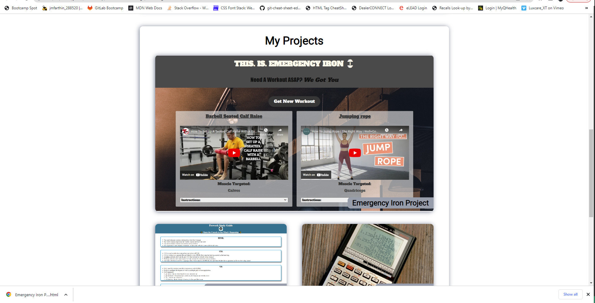
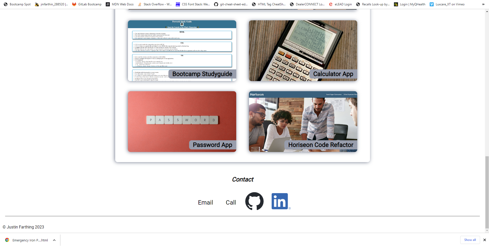
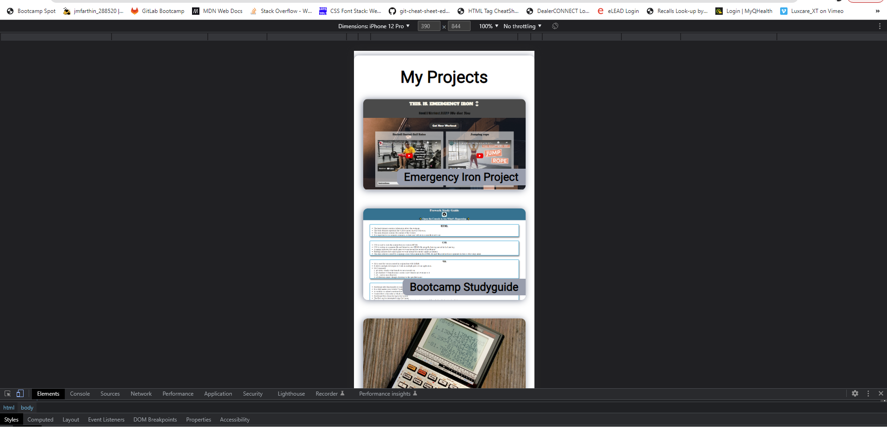

# JFarthing Portfolio

## Description

This project is the landing page for my portfolio of web development projects to date. It's purpose is to showcase my current knowledge of website building and to highlight certain proficiencies such as:

- Semantic HTML
- CSS selectors and variables
- Flexbox
- Media queries and responsive design

## Usage

To view portfolio website, visit: https://jmfarthin.github.io/JFarthing-Portfolio/

Repository: https://github.com/jmfarthin/JFarthing-Portfolio.git

### Screenshots of deployed website:

## Credits

### Images:

- GitHub icon provided by GitHub
- LinkedIn icon provided by LinkedIn
- Calculater image by Pixabay: https://www.pexels.com/photo/scientific-calculator-on-wooden-surface-220301/
- Password image by Miguel Á. Padriñán: https://www.pexels.com/photo/close-up-shot-of-keyboard-buttons-2882630/

## License

Licensed under the general usage MIT license.
Copyright (c) 2023 Justin Farthing